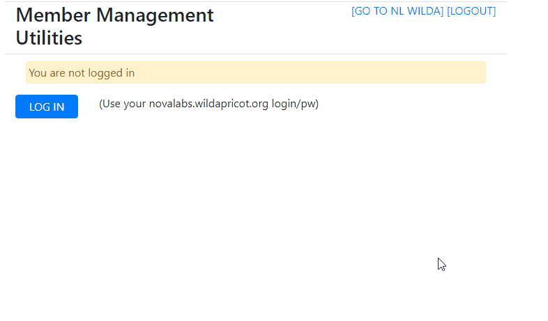

# Wild Apricot Flask Utilities
Web interface for maker space tool sign-offs implemented in python flask with Wild Apricot oauth and rest on the back end.

[Wild Apricot](https://www.wildapricot.com/) is a commercial member management system for non-profits and clubs. It provides **oAuth** for authentication and a RESTful API.  If you prefer to code your web applications using **Python+Flask** I hope you find this useful to look at.

## Install
 ```git clone (this repo)
 cd (this repo)
 python3 -m venv venv
 source venv/bin/activate (or on windows source venv/Scripts/activate)
 pip3 install -r requirements.txt
 
 ```
## Run
```python3 wautils.py```
Connect by browsing to http://localhost:7000

## Walk through
On page load, flask delivers **wautils.js** which implements the UI. On the server, **app.py** implements a series of RESTful endpoints.  When the user clicks on **login**, it call **/authorize/wildapricot** Which checks with wildapricot for a valid oauth session and token. If none exists, the user will be redirected to the wild   apricot login/password window to be authenticated.

Once authenticated, the flask server establishes a login session and renders the **utils** page. It checks with wildapricot to determine if the user has wild apricot admin credentials. If so, the user is allowed to continue to the **utils** page. Currently, the only functionality is signoffs and a link is provided.

For all pages, the server makes a call to wildapricot to establish if the user has wilapricot admin credentials and congratulates the user if they do. The  **signoffs** page is restricted to admins and will not render unless the user is authorized.

Once at the signoffs is loaded, **wautils.js** Begins to make use of the very powerful **get_any_endpoint** call to the server. At this point the server acts as a simple pass-through to wildpapricot. Any API endpoint implemented by wildapricot could be  easily implemented in the js.
The signoffs page requests a list of all contact fields available via the**contactfields** endpoint.  Tool sign-offs are implemented as a series of checkboxes in wildapricot. The users names and signoffs are rendered. If the user clicks on the edit button for  a user, they are sent to a page where they can edit the users individual signoffs. the **save** button will update the user's record.

## What's required on Wild Apricot

You will need to define a Multiple Choice member field which contains a list of possible signoffs. The Field Lable is hard-coded to 'NL Signoffs and Categories', but this is easily changed in wautils.js. Also, certain grouping categories such as LASER, ARTS&CRAFTS, etc are also hard-coded in wautils.js

